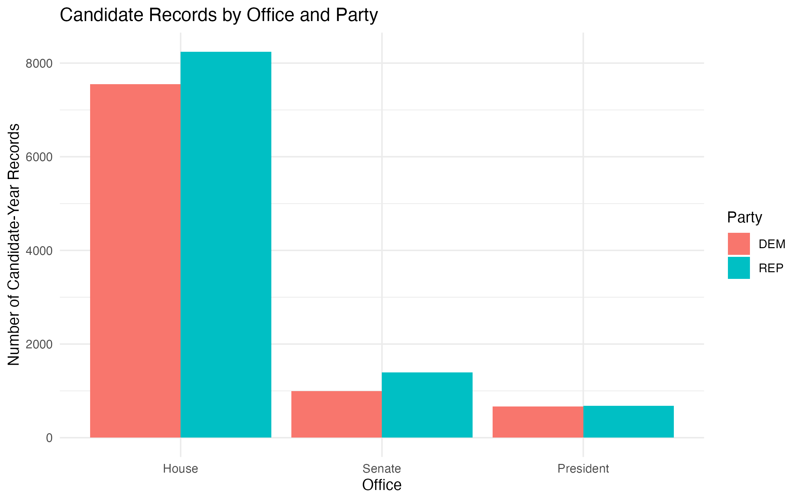
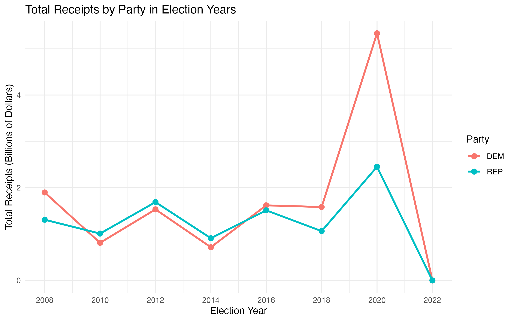
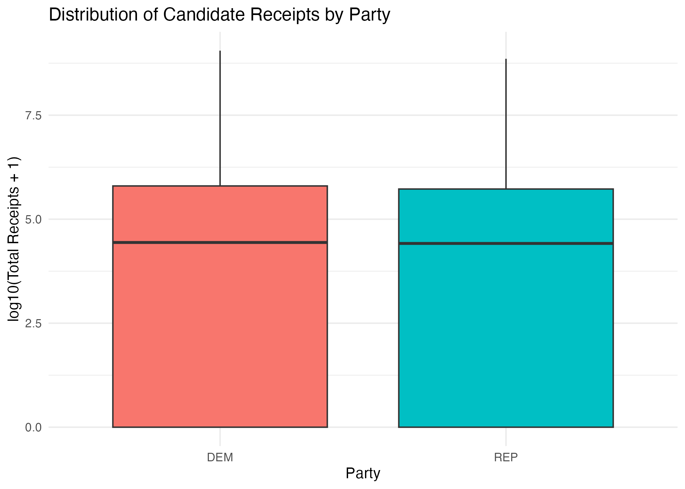
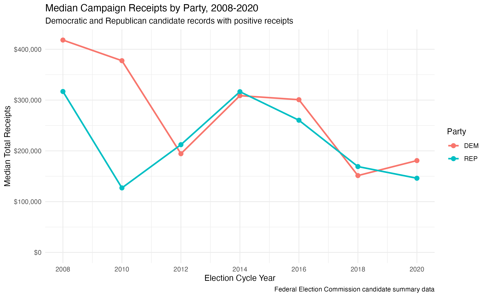
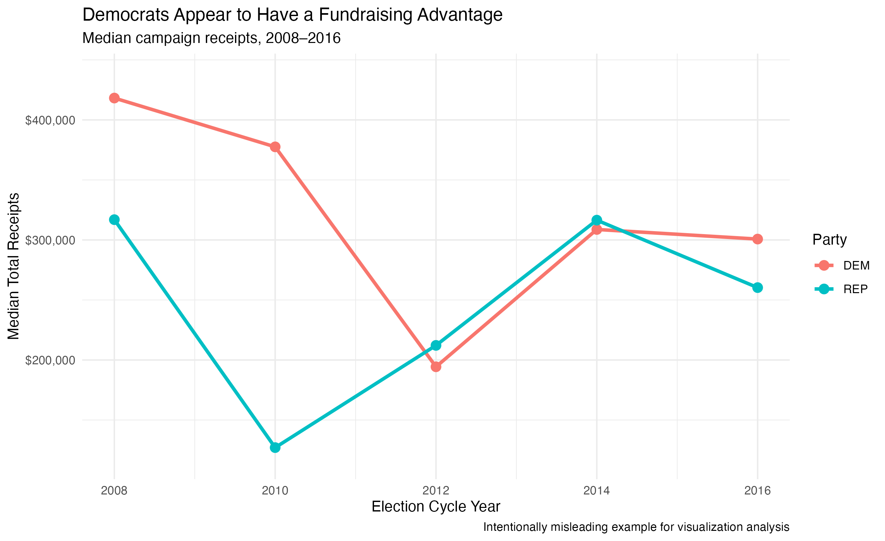
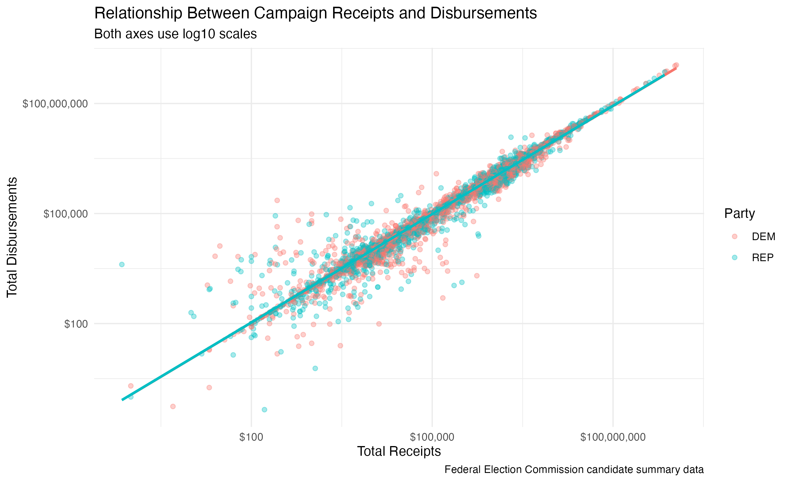
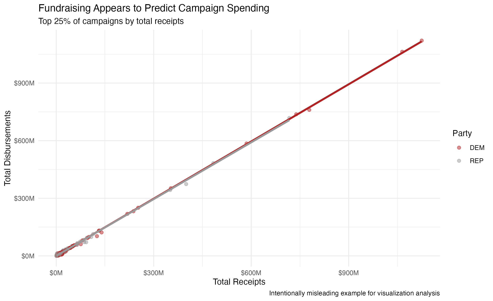

# Information Visualization in R

This project explores how visualization choices can affect the way people interpret data. I used R and ggplot2 to analyze campaign finance data, then created paired examples showing how the same data can tell a different story depending on filtering, scale, framing, and other design choices.

## Project Context

This project started from my work in INF 143, Information Visualization, at UC Irvine.

Some of the original assignments were completed with a teammate. This repository only includes the analysis, code, and visualizations that I was responsible for, reorganized as a standalone portfolio project.

My work focused on:

* exploring candidate records across office types and parties
* comparing campaign receipts across election years
* examining the distribution of candidate receipts
* looking at the relationship between receipts and disbursements
* creating intentionally misleading versions of selected visualizations
* comparing how different design choices affect interpretation

## Exploratory Analysis

### Candidate Records by Office and Party

I first compared candidate records across House, Senate, and Presidential elections.



This gave me a basic sense of how the records were distributed before looking at campaign finance values.

### Total Receipts Across Election Years

Next, I grouped total receipts by party and election year.



This view focuses on aggregate totals across election cycles. Since totals can be strongly affected by large campaigns, I also wanted to look at the distribution of individual candidate records.

### Distribution of Candidate Receipts



I used a log transformation because campaign receipt values have a wide range. This makes the overall distributions easier to compare visually.

## When a Chart Becomes Misleading

The part of this project I found most interesting was seeing how a chart can use real data and still create a different impression through design choices.

I created two examples using the same underlying dataset.

### Case 1: Median Campaign Receipts Over Time

#### More Complete View



This version includes election cycles from 2008-2020 and keeps the y axis anchored at zero.

#### Intentionally Misleading View



For this version, I changed several things:

* limited the time period to 2008-2016
* truncated the y axis
* removed later election cycles
* used a title that encourages a stronger interpretation

The data values were not changed. The difference comes from what is shown and how the chart is framed.

### Case 2: Campaign Receipts and Disbursements

#### More Complete View



This version includes all qualifying observations, uses log scales for both axes, and shows a fitted linear trend with a confidence band.

#### Intentionally Misleading View



For this version, I:

* kept only the top 25 percent of records by total receipts
* removed the log transformations
* removed the confidence band
* used color to direct attention toward one group

The result looks cleaner and more certain even though much of that difference comes from the visualization choices rather than changes to the underlying data.

## What I Learned

This project made me think more carefully about the decisions behind a visualization.

Filtering, aggregation, axis limits, transformations, uncertainty, and color can all affect what the viewer notices. A chart can be technically based on real data while still giving an incomplete impression.

It also showed me why looking at the same question from multiple views can be useful. Aggregate totals and individual level distributions can highlight different parts of the data.

The party comparisons in this project are used to study visualization design and interpretation. The purpose is not to make a political argument.

## Tools

* R
* ggplot2
* dplyr
* stringr
* readr
* scales

## Data

The project uses Federal Election Commission candidate summary data for election cycles from 2008-2022.

The dataset used in the original coursework is documented in [`data/README.md`](data/README.md).

The raw CSV is not stored in this repository. The R scripts load the data directly from the documented source.

For more information about FEC candidate summary data:

https://www.fec.gov/campaign-finance-data/candidate-summary-file-description/

## Repository Structure

```text
information-visualization-r/
├── R/
│   ├── exploratory_visualizations.R
│   └── misleading_visualizations.R
├── data/
│   └── README.md
├── images/
│   ├── candidate_records.png
│   ├── receipts_by_year.png
│   ├── receipt_distribution.png
│   ├── correct_receipts_by_party.png
│   ├── misleading_receipts_by_party.png
│   ├── correct_receipts_vs_spending.png
│   ├── misleading_receipts_vs_spending.png
│   └── README.md
├── .gitignore
└── README.md
```

## Running the Analysis

Install the required packages if needed:

```r
install.packages(c(
  "ggplot2",
  "dplyr",
  "stringr",
  "readr",
  "scales"
))
```

Run the two scripts from the repository root:

```r
source("R/exploratory_visualizations.R")
source("R/misleading_visualizations.R")
```

The generated figures will be saved in the `images/` folder.

## Limitations

This is a descriptive visualization project rather than a causal analysis.

A few things to keep in mind:

* campaign finance values are highly skewed
* aggregate totals can be influenced by large campaigns
* different filtering choices can change what is visible in a chart
* the intentionally misleading charts are included only as visualization design examples